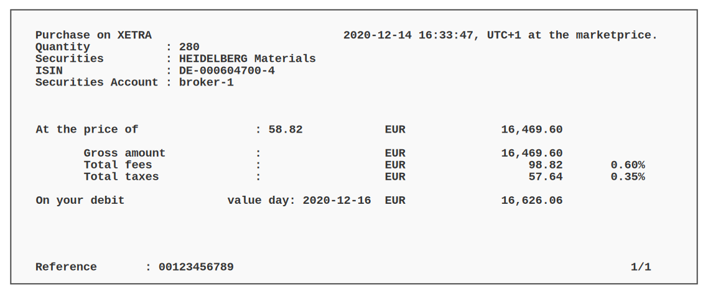
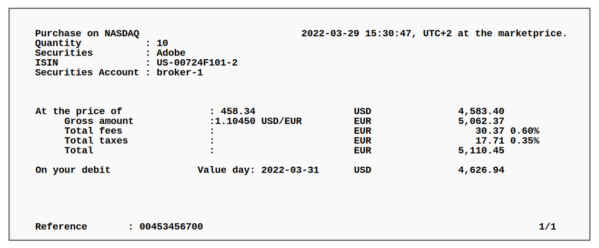

Wenn Du eine Abrechnung von Deiner Bank oder Deinem Makler erhältst, in der eine Transaktion beschrieben wird, wie in Abbildung 1 dargestellt, musst Du diese Transaktion in Portfolio Performance erfassen. Solltest Du lediglich einen Ausdruck der Transaktion erhalten, so musst Du die Buchung manuell anlegen. Stellt Dir Deine Bank oder Broker ein PDF zur Verfügung, so kannst Du es [importieren](../../referenzhandbuch/datei/import.md).

## Transaktion mit einheitlicher Währung

Die Transaktion in Abbildung 1 betrifft nur eine Währung. Sowohl das Wertpapier als auch das Referenzkonto verwenden die gleiche Währung (EUR).  Es ist keine Währungsumrechnung erforderlich.

Abbildung: Kaufabrechnung über Wertpapierkauf.{class=pp-figure style="width: 90%"}

Mit dieser Abrechnung kannst Du eine Transaktion in Portfolio Performance anlegen. Abbildung 2 zeigt die Eingabemaske für die Buchungsinformationen. Das Wertpapier (Heidelberg Materials) ist in EUR notiert und die Transaktion wird über das Wertpapierkonto „Broker-1“ und das Depotkonto „Broker-1 (EUR)“ abgewickelt. Das Beispiel eines [Wertpapierverkaufs](verkauf.md) beinhaltet eine komplexere Konfiguration mit einem in USD notierten Wertpapier, aber die Transaktion wird über ein Depotkonto in EUR abgewickelt.

Abbildung: Kauf eines Wertpapiers in Euro über ein Euro Konto.{class=pp-figure style="width: 90%"}

- **Wertpapier**: Du kannst das Wertpapier aus der Dropdown-Liste auswählen. Wenn ein bestimmtes Wertpapier bereits vor dem Start der Transaktion ausgewählt wurde, wird diese Information vorausgefüllt. Bitte beachte, dass die Währung automatisch ausgefüllt wird, da jedes Wertpapier eine Referenzwährung hat, die beim [Anlegen des Wertpapiers](../intro-wertpapiere-anlegen.md) festgelegt wird. Die Liste aller verfügbaren Wertpapiere findest du in der Seitenleiste unter `Wertpapiere > Alle Wertpapiere`

- **Depot**: Wähle aus dem Dropdown-Menü, oder lasse es vorausgefüllt, wenn Du von einem Depot aus Deine Transaktion pflegen möchtest.

- **Konto**: Wähle aus dem Dropdown-Menü oder lass das Feld mit dem [Konto](../../referenzhandbuch/ansichten/stammdaten/konten.md) des Wertpapiers vorausgefüllt. Wenn die Währung des gewählten Referenzkontos von der Währung des Wertpapiers abweicht, musst Du den Bruttobetrag samt Gebühren und Steuern umrechnen, wofür ein Wechselkurs erforderlich ist. Siehe Beispiel [Verkauf von Wertpapieren](verkauf.md).

- **Datum der Transaktion**: Du kannst das Datum aus dem Kalender auswählen oder es manuell eingeben (Format = JJJJ-MM-TT). Auf der rechten Seite (00:00) kannst Du die Transaktionszeit eingeben. Die Wahl zwischen 12- oder 24-Stunden-Format wird durch die Menüeinstellung `Hilfe > Einstellungen > Sprache > Land` bestimmt. Das Vereinigte Königreich verwendet beispielsweise das 12-Stunden-Format (mit AM und PM), während Belgien ein 24-Stunden-Format verwendet.

- **Stücke**: Die Stückzahl des Wertpapiers, die Du kaufen oder verkaufen möchtest. Du kannst auch Bruchstücke (Dezimalzahl) eintragen.

- **Kurs**: Hierbei handelt es sich um den Preis, den Du für eine Aktie bezahlst. Wenn das Wertpapier historische Kurse enthält (siehe [Bestände erstmalig aufbauen](../intro-bestaende-erstmalig-aufbauen.md), ist ein Kurs für das jeweilige Datum bereits eingetragen. Dieser historische Kurs stimmt jedoch möglicherweise nicht mit den Angaben Deines Brokers überein, da er auf Tagesendkursen basiert, während der Broker Echtzeitdaten verwendet.

Die oben genannten sechs Felder sind für den Abschluss der Transaktion *erforderlich*. Die meisten dieser Felder werden auf Grundlage des ausgewählten Wertpapiers vorausgefüllt. Die folgenden Felder sind entweder vorgefüllt oder optional.

- **Kaufpreis**: Ist das Ergebnis der Multiplikation von Stücken mit Kurs.
- **Gebühren** und **Steuern** bei einer Verkaufstransaktion fallen in der Regel Gebühren und Steuern an. Diese können auf die Währung des Wertpapiers und/oder des Depotkontos lauten (siehe [Verkauf von Wertpapieren](verkauf.md) für ein Beispiel).
- **Belastung**: ist der Betrag, den Du als Ergebnis Deiner Kauftransaktion zahlen musst. Er wird folgendermaßen berechnet: Aktien * Kurs + Gebühren + Steuern. Andere Bezeichnung dafür wäre Endbetrag.
- **Notiz**: hier kannst Du eine Notiz anlegen, die in verschiedenen Ansichten hilfreich sein kann.

Der typische Ablauf für die Eingabe dieser Informationen lautet:
  
`Stücke * Kurs >> Kaufpreis + Gebühren + Steuern >> Belastung`

Wenn Du nachträglich Änderungen vornimmst, gibt es ein paar Besonderheiten zu beachten. (Siehe Abbildung 3)

Abbildung: Ablauf zwischen Stücke und Belastung.{class=pp-figure style="width: 100%"}

- Wenn Du die *Belastung* (im Nachhinein) änderst, wird der Kaufpreis und damit auch der Kurs angepasst. Die Anzahl der Aktien bleibt unverändert.

- Eine nachträgliche Änderung des *Kaufpreises* führt zu einer Änderung der Belastung und des Kurses. Gebühren, Steuern und die Anzahl der Aktien bleiben davon unberührt.

## Transaktion mit 2 Währungen
Wenn Du Aktien in einer Fremdwährung kaufen willst, gibt es zwei Möglichkeiten. Entweder Du hast den erforderlichen Betrag in der Fremdwährung auf einem Depotkonto. Oder Du musst zuerst eine [Einzahlung](einzahlung.md) in Heimatwährung buchen, gefolgt von einer [Umbuchung](einzahlung.md#umbuchung-zwischen-unterschiedlichen-wahrungen) in Fremdwährung. 

Abbildung 4 zeigt die Abrechnung der Bank über den Kauf von Wertpapieren in US-Dollar. Da Steuern und Gebühren in EUR abgerechnet werden müssen (da es sich um eine europäische Bank handelt) und die Basiswährung des Portfolios für die Vermögensaufstellung ebenfalls EUR ist, wird der Gesamtbetrag in USD ebenfalls in EUR umgerechnet.

Abbildung: Abrechnung eines Kaufs in US-Währung.{class=pp-figure style="width: 100%"}

Aus der Abrechnung geht nicht eindeutig hervor, welches Einlagenkonto (EUR oder USD) verwendet wurde. Die Erfassung dieser Transaktion in Portfolio Performance ist jedoch recht einfach. Abbildung 5 zeigt die Transaktion, die mit einem USD-Einlagenkonto durchgeführt wurde. Abbildung 6 ist etwas komplexer, da ein EUR-Einlagenkonto verwendet wird; daher muss eine Umrechnung vorgenommen werden (EUR --> USD).

Abbildung: Kauf eines Wertpapiers in US-Dollar mit einem Fremdwährungskonto.{class=pp-figure style="width: 60%"}

Abbildung: Kauf eines Wertpapiers in US-Dollar mit einem.{class=pp-figure style="width: 60%"}

Der Kurs und der USD/EUR-Wechselkurs werden automatisch auf Grundlage des eingegebenen Datums eingefügt. Bitte beachte jedoch, dass keine Echtzeitpreise verfügbar sind. Die Eingabemaske in Portfolio Performance bietet außerdem die Möglichkeit, Gebühren und Steuern in Fremdwährung zu erfassen. 

Denke daran: Es macht durchaus Sinn, vor einem Kauf ein gedecktes Konto zu haben, entweder in US-Dollar (für die Transaktion in Abbildung 5) oder in EUR (Abbildung 6). Ist das Konto nicht gedeckt, entsteht ein negativer Saldo.