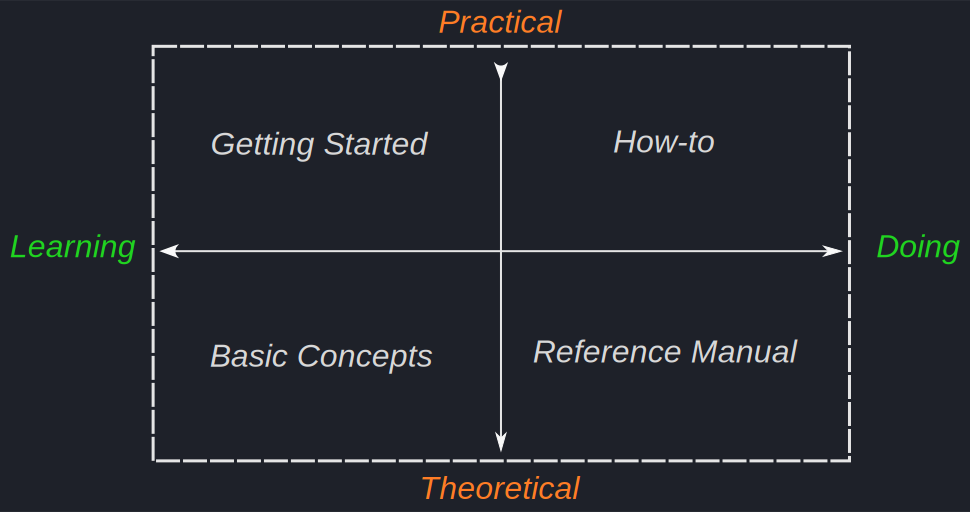

Abbildung: Documentation framework.{class=align-right style="width:50%"}

Dieser Abschnitt des Handbuchs soll Dir helfen, alle Merkmale und Funktionen von Portfolio Performance in einer realen Arbeitsumgebung zu nutzen.  Im Gegensatz zum Abschnitt "Erste Schritte", der allgemeiner gehalten ist und vereinfachte Beispiele verwendet, zeigt dir der Abschnitt "Anleitungen", wie Du das Programm in einer realen Umgebung mit realen Daten nutzen kannst.

Der Abschnitt "How-to" behandelt Themen wie [unterschiedliche Währungen](waehrungen.md), [Reinvestieren von Dividenden](wahldividenden.md), Erfassen von [Aktiensplits](aktien-splitt.md) und [Spin-offs](spin-off.md), [Herunterladen von historischen Kursen](historische-aktienkurse/index.md) aus verschiedenen Quellen und vieles mehr.

Die Anleitungen sind kein Ersatz für die Übungen, die eine umfassendere und pädagogische Einführung in das Programm bieten. Er ist auch kein Ersatz für die Abschnitte Grundkonzepte und Referenzhandbuch, in denen die theoretischen Grundlagen und die technischen Details des Programms erläutert werden. Das How-to  soll diese anderen Abschnitte ergänzen, indem es praktische Anleitungen und Tipps zur effektiven Nutzung des Programms gibt.

Wir haben auch einige Tipps und Tricks hinzugefügt, von denen viele ursprünglich im [Portfolio Performance Forum](https://forum.portfolio-performance.info) diskutiert wurden. Erwähnt werden sollte, dass ein Großteil der Informationen nur auf Deutsch und Englisch behandelt wird, allerdings kannst Du die automatische Übersetzung Deines Browsers benutzen.

