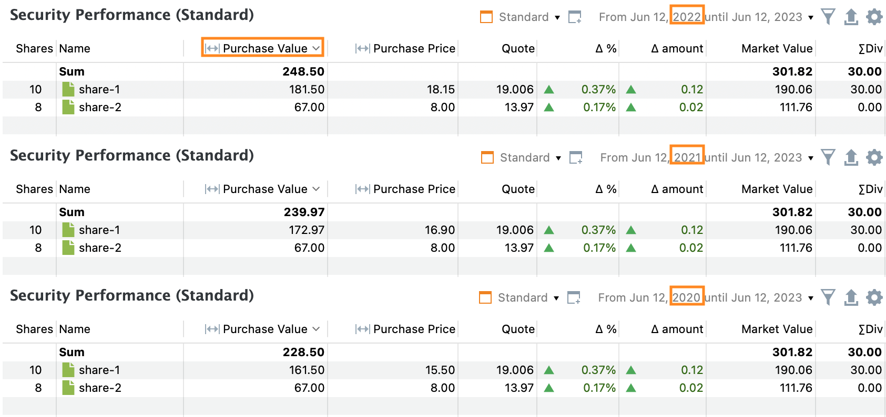

The **Purchase Value** of a security is the total cost required to acquire that security within a given [Reporting Period](./reporting-period.md). The price per share depends on the purchase date in relation to the Reporting Period.  

- If the purchase occurs **within** the Reporting Period, the value is the sum of all Buy Transactions (+) and Sell Transactions (-), including fees and taxes.  
- If the purchase occurred **before** the Reporting Period, the value is based on the Market Value at the start of the period. The original buying price is *not* taken into account, as if the security were purchased at the beginning of the Reporting Period.  
- If the purchase occurs **after** the Reporting Period, the Purchase Value is zero. No securities are available in that period.  

The **Purchase Price** is the hypothetical average purchase price per share, based on all purchases or valuations. The concepts Purchase Value and Purchase Price are used in [View > Reports > Performance > Securities](../reference/view/reports/performance/securities.md) (see Figure 1).  

For reference, assume the scenario from [demo-portfolio-03.xml](../assets/demo-portfolio-03.xml). An overview of all transactions is provided in the section on [Money Weighted Rate of Return](./performance/money-weighted.md).  

Figure: Purchase value of securities for multiple Reporting Periods. {class=pp-figure}

As shown in Figure 1, the reported Purchase Value of some securities (e.g., `share-1`) depends on the selected Reporting Period. However, let's first focus on `share-2`, whose Purchase Value and Purchase Price remain unchanged across all three reporting periods.  

From [demo-portfolio-03.xml](../assets/demo-portfolio-03.xml), you know that 8 shares were purchased on 30 September 2022 for 8 EUR/share, totaling 67 EUR, including 3 EUR in fees and taxes. Since this purchase date falls within each reporting period, the actual purchase data serve as the basis for all three reporting periods, resulting in a Purchase Value of 67 EUR and a Purchase Price of 8 EUR/share.  

`Share-1` is more complex. Ten shares were purchased on 15 January 2021 for a total of 155 EUR (including fees and taxes), and 5 shares on 14 January 2022 for 84 EUR. Five shares were sold on 12 April 2023 for 105 EUR.  

The historical prices for the 3-, 2-, and 1-year Reporting Periods are*14.705 EUR, 17.794 EUR, and 18.15 EUR/share, respectively. See Figure 2 of [Money Weighted Rate of Return](./performance/money-weighted.md) for more details.  

- **1-Year Reporting Period**  

Both purchases occurred before the start of the Reporting Period. The historical price of 18.15 EUR/share at the beginning of the period is used to value the security.  

At the start of the period, 15 shares were in the portfolio, with a total value of 15 × 18.15 EUR = 272.25 EUR. During the period, 5 shares were sold. The remaining 10 share* were worth (272.25 × 10/15) = 181.50 EUR, which is exactly the Purchase Value for this 1-Year Reporting Period.  

The Purchase Pric* is*18.15 EUR/share, which matches the historical price at the beginning of the Reporting Period.  

- **2-Year Reporting Period**  

Since the period starts on 12 June 2021, the first purchase falls outside the period, while the second purchase and the sell transaction occur within the period.  

At the beginning of the period, the 10 existing shares are valued at 10 × 17.794 EUR/share = 177.94 EUR. Under the FIFO principl*, 5 shares are sold, leaving a remaining value of 177.94 / 2 = 88.97 EUR.  

An additional 5 shares are purchased for 84 EUR. Thus, the total Purchase Value*for this period is 88.97 + 84 = 172.97 EUR.  

The Purchase Price*is the weighted average of the first purchase valuation (17.794 EUR/share) and the second purchase (16 EUR/share), calculated as: (17.794 + 16) / 2 = 16.90 EUR/share.

- **3-year Reporting Period**

Since all transactions occur within the Reporting Period, the actual purchase data are used.  

The first purchase of 10 shares is valued at 155 EUR. After the sale, only 5 shares remain, resulting in an intermediate Purchase Value of 155 / 2 = 77.50 EUR.  

The second purchase is valued at 84 EUR, giving a final Purchase Value of 77.50 + 84 = 161.50 EUR. This calculation is shown in the pop-over when hovering over the Purchase Value (see Figure 3).  

Figure: Pop-over panel for the Purchase Value field. {class=pp-figure}  

  

The Purchase Price is the average of the first and second buying prices, calculated as: (15 + 16) / 2 = 15.50 EUR/share.  