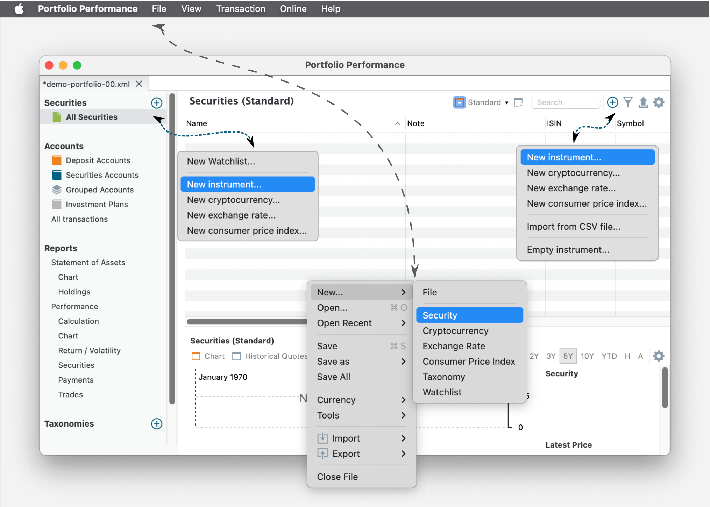
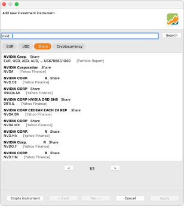
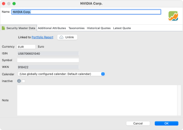

Right after completing the *Create Portfolio* step, your portfolio will still be empty. You can verify this by navigating to the left sidebar and selecting `Securities > All Securities`. This list displays all the securities you are monitoring, **not** just the ones you have purchased. At this stage, the list will be empty (see Figure 1).

!!! note

    A security is a financial instrument that holds value and can be traded between parties. Securities can be broadly categorized into: debt securities (e.g., banknotes, bonds, and debentures), equity securities (e.g., common stocks), derivatives (e.g., forwards, futures, options, and swaps) [\[Source Wikipedia\]](<https://en.wikipedia.org/wiki/Security_ (finance)>).

Figure: Main screen after creating a new portfolio.{class=pp-figure}

The :octicons-plus-circle-16:{.green} `Add new investment instrument` button (left and right; see Figure 1)allows you to start adding securities to your portfolio. As you can see in Figure 1, you can add new instruments (stocks, bonds, ...), cryptocurrencies, exchange rates. You can also import securities from a CSV-file or to create a new empty security. This last option allows you to bypass the creation wizard and displays immediately the [Security master data](../reference/file/new.md#security-master-data) dialog box.  You could also use the menu `File > New` menu (see Figure 1).

**New instrument creation wizard**

Suppose you intend to acquire NVIDIA shares. *Before* proceeding with the purchase, you must first add the specific share to the list of Securities. To achieve this, choose either `New > Security` from the File menu or click on one of the :octicons-plus-circle-16:{.green} `New Instrument...` buttons. This action will open the following window (refer to Figure 2).

Figure: Searching and adding new securities to the All Securities list.{class=pp-figure}

You can type (part of) the security name in the search box, e.g., *NVID*. Using the buttons `EUR`, `USD`, `Share`, and/or `Cryptocurrency`, you can limit the search to specific categories. After clicking the `Search` button, the list below will be populated with possible target instruments (see Figure 2). As shown in Figure 2, historical prices are provided by sources such as Portfolio Report and Yahoo, covering many stock markets. The next button allows you to view the actual historical prices.

After selecting the appropriate security (and stock market), click the `Apply` button to proceed to the next step. Certain information, such as the name, symbol, and historical quotes, will be pre-filled based on the selected data source. You can modify all this information, including the name, to suit your needs. Please note that, in Figure 3, the currency for the NVIDIA share is set to EUR, which may not apply to your situation.

!!! Note
    More information about downloading historical prices from several providers, including [Portfolio Report](../how-to/downloading-historical-prices/portfolioreport.md), [Yahoo](../how-to/downloading-historical-prices/yahoo-finance.md), [Morningstar](../how-to/downloading-historical-prices/morningstar.md), and many others, can be found in the section [How-to > Downloading Historical Prices](../how-to/downloading-historical-prices/index.md).

Figure: Panel for entering info about the selected security.{class=pp-figure}

In some cases, starting with an empty instrument and manually inputting the information might be more straightforward. While only the name is mandatory, it is advisable to set additional details such as `Currency`, `Symbol`, and `Historical Quotes Feed`.

More information about all these attributes can be found in the [Reference Manual > File > New](../reference/file/new.md). Finding the correct settings to import the Historical Prices of your security is described in the [How-to section](../how-to/downloading-historical-prices/index.md).