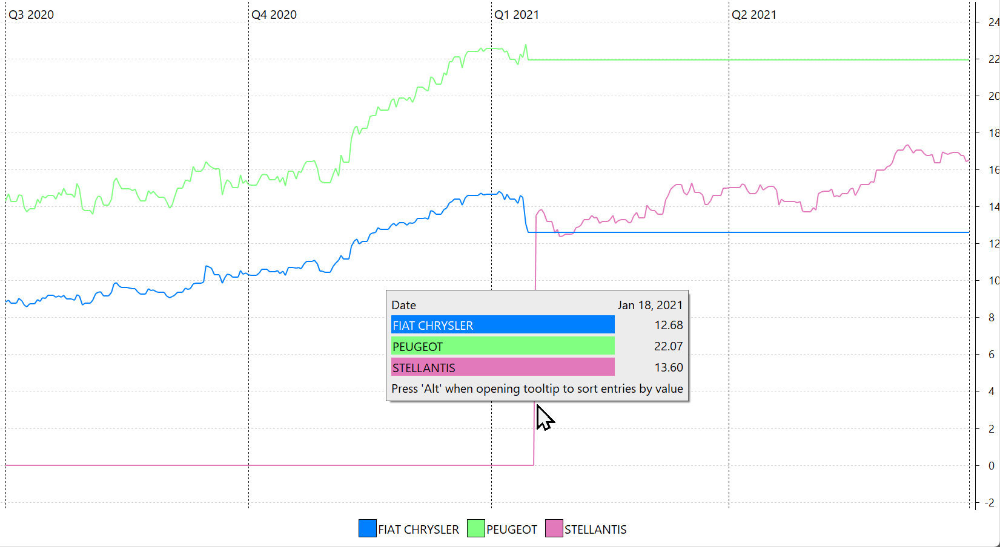

A merger occurs when two separate companies join forces to form a new organisation, whereas an acquisition involves one company taking over another. As explained by [Investopedia](https://www.investopedia.com/ask/answers/021815/what-difference-between-merger-and-acquisition.asp), the distinction between these two terms has become increasingly blurred.

On Saturday, 16 January 2021, the merger between Peugeot S.A. (PSA) and Fiat Chrysler Automobiles N.V. (FCA) was finalised, leading to the creation of Stellantis N.V. (STLA). Figure 1 shows historical price data for the companies involved, downloaded from XETRA via PortfolioReport, with the respective ISIN numbers: FCA (NL0010877643), PSA (FR0000121501), and Stellantis (NL00150001Q9).

Figure: Historical prices for Fiat, Peugeot, and Stellantis from 2020-07-01 to 2021-07-01. {class=pp-figure}

The compensation for the old shareholders in the Stellantis merger was: 

- Each FCA shareholder received 1 Stellantis share for every FCA share they held.
- Each PSA shareholder received 1.742 Stellantis shares for every PSA share they held.

As shown in Figure 1, the closing prices of the companies on the day before the Stellantis merger were: FCA at €12.68 and PSA at €22.07. Based on the compensation ratio, the PSA price was expected to be 1.742 × FCA Price, or €12.68 × 1.742 = €22.09, which nearly matches PSA’s closing price of €22.07. Stellantis had a positive debut on European stock markets following the merger, with shares rising by 8% on the first trading day, from €12.68 to around €13.60.

Recording this merger in Portfolio Performance is straightforward, as it involves creating a new security. To update your portfolio:

1. Sell the FCA and PSA shares at their respective prices.
2. Buy the Stellantis (STLA) shares. The number of Stellantis shares purchased is calculated as 1.742 × FCA shares + PSA shares. Since fractional shares cannot be traded, your broker will likely round down the number of Stellantis shares, leaving a small cash surplus in your deposit account.