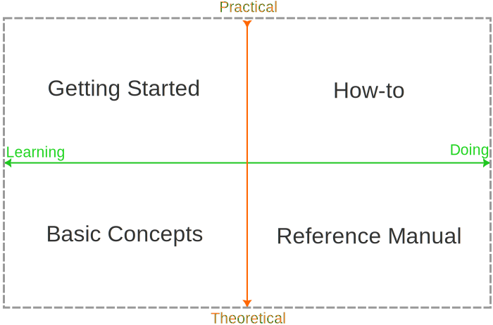

## What is Portfolio Performance?

Since the beginning of 2012, [Portfolio Performance](https://portfolio-performance.info) has been available to calculate the performance of an overall portfolio – across various depots and accounts – based on the True-Time Weighted Rate of Return and the internal rate of return.

*Portfolio Performance* is a simple and powerful tool for managing your securities portfolio. With *Portfolio Performance*, you can:

- track the composition and development of your securities portfolio with meaningful overviews, key figures, and charts.
- track historical price developments of securities and your purchases and sales.
- classify the securities in your portfolio according to your needs and visualize the composition, e.g., by asset classes and regions.
- define and track your portfolio strategy with your planned asset allocation and ensure rebalancing.
- create a comprehensive view across multiple depots and clearing accounts.
- quickly and conveniently import statements from online banks and brokers.

*Portfolio Performance* (PP) itself tries to remain as simple and intuitive as possible. However, explanations are sometimes necessary – as shown by the many similar questions in the [forum](https://forum.portfolio-performance.info). This "handbook" is intended to guide you through the first steps with *Portfolio Performance*, explain basic concepts, and document the features that require explanation.

The **Portfolio Performance** (PP) guide consists of four chapters, derived from a well-known [framework for creating documentation](https://fachglossar.platinus.at/docs/Glossar/D-Glossar/Diataxis-Framework/). The documentation is structured along two axes: practical versus theoretical knowledge and learning versus applying.

- [Getting started](getting-started/index.md)
  If you are new to Portfolio Performance, this chapter will make it easier for you to get started.
  It covers everything from installation to creating a new portfolio, importing securities and transaction data, and evaluating your entire portfolio.

- [Basics](concepts/index.md)
  Although Portfolio Performance is an extremely intuitive and user-friendly program, the underlying financial concepts can be complex. This chapter provides a brief but clear understanding of the most important Portfolio Performance concepts, such as accounts, transactions, reporting periods, internal rate of return, and more.

- [Reference Manual](reference/index.md)
  is a detailed and technical description of all functions and elements of the program's user interface.

- [How-to](how-to/index.md)
  In this chapter, you will find step-by-step descriptions of common procedures, including data import, dividend posting, searching for historical prices, and more. Some tips & tricks as well as special cases are also described.

## Help Out...

As you can easily see, there are still many blank pages in this handbook.
If you are interested, please also contact us in the forum! [Many thanks to everyone who has helped so far.](https://github.com/portfolio-performance/portfolio-help/graphs/contributors)