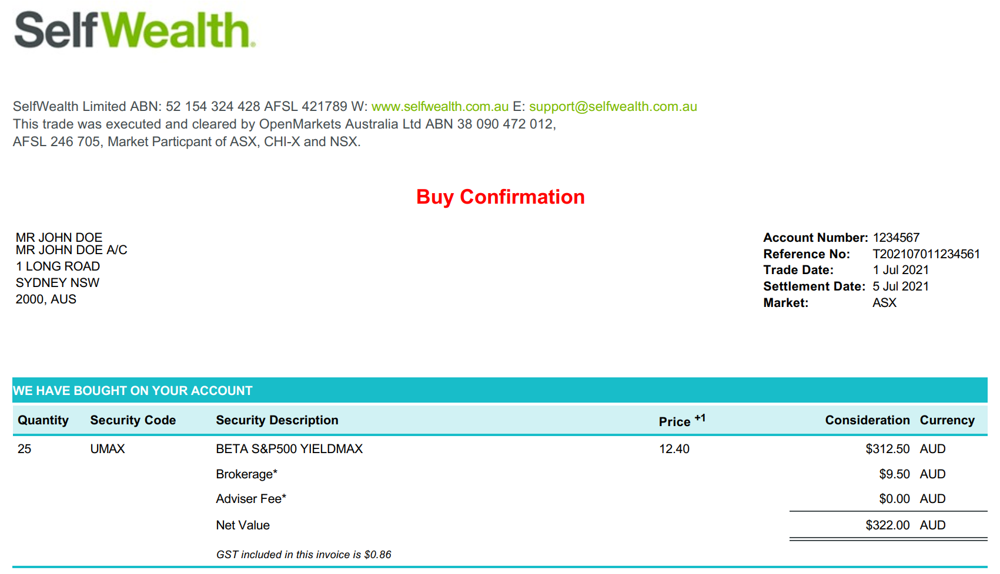
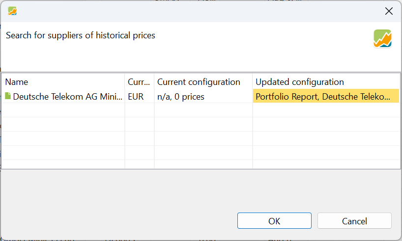

Banks and brokers often provide transaction statements (buy, sell, dividend, etc.) for your convenience on paper or in PDF format. PP can read PDF documents from more than 90 banks and brokers and import the described transactions. The PDF in Figure 1 describes a (fictitious) buy transaction from an Australian broker. If you want to follow along with the example, you can [download](../../../assets/SelfwealthBuy01.pdf) the PDF document.

Figure: Buy statement from SelfWealth of 25 pcs of Beta SP500 YieldMax. {class=pp-figure}



## Checking the Existence of the Importer

PP must "know" some details about the PDF document from your bank or broker. For example, the type of transaction in Figure 1 is identified by the title "Buy Confirmation," and the ticker symbol (UMAX) is indicated under the column header "Security Code." PP must recognise these details for each transaction to extract the necessary content from the PDF. Therefore, for each supported bank or broker, PP has developed a specific importer (parser) with knowledge of the different [transaction types](../../transaction/index.md). To develop these importers, PP relies on information provided by its users (see [Requesting a New Importer](pdf-import.md#requesting-a-new-importer)).

To verify if your bank or broker is supported, try to import a PDF document (see next section). The import wizard will either recognise it automatically or display an error message listing all the banks/brokers it has tried. You can also search the [forum](https://forum.portfolio-performance.info/c/english/) using the term `PDF import` or `PDF import [name-of-your-bank-or-broker]` to see if an importer for your institution is available or if there are any issues with it. If the importer exists, you can move on to the next section. Otherwise, you need to first request a new importer (see [Requesting a New Importer](pdf-import.md#requesting-a-new-importer)).

## Importing a PDF

Use the menu File > Import > Import PDF Bank Documents or the shortcut key CTRL+I, P, and navigate to the PDF document on your local system. You can select more than one PDF document. If a document is recognised by PP (i.e., an importer exists for the bank or broker of this document), an Import Transaction dialog box, such as in Figure 2, is displayed.

In this particular case, there is a small problem and the import operation could not be fully executed. The error message at the bottom provides an indication: the cash account `Call Money Account` from the demo Kommer portfolio is used for the cash handling of the transaction, but this deposit account is in EUR while the transaction currency is AUD. Selecting (or creating) an AUD deposit account will fix the problem. Please note that in Figure 2, two operations are scheduled: (1) the buy transaction, and (2) the creation of the security `Beta S&P500 Yieldmax`. If this security already exists in the portfolio, then the import wizard will use the existing security.

Figure: Imported transaction from PDF of Figure 1. {class=pp-figure}


Figure: Search for suppliers of historical prices (example available at Portfolio Report). {class=align-right style="width:60%"}



In the case of a new security, a `Search for suppliers of historical prices` box is displayed. If the security is listed on [Portfolio Report](../../../how-to/downloading-historical-prices/portfolioreport.md), then the historical prices could be automatically added. Otherwise, the security is created, but you will need to manually edit the data source to [download the historical prices](../../../how-to/downloading-historical-prices/index.md).

<br style="clear:both;">

## Requesting a New Importer

If PP doesn't have a PDF importer for your bank/broker or for the specific type of transaction you need, you can request the development of this importer. Since PP developers don't have access to every bank or broker, you — as a user — must provide some sample PDF documents with real but anonymised examples of transactions with that specific bank or broker. The following text describes all the necessary steps:

Figure: Extracted text from testPDF. {class=pp-figure}


1. **Collect the PDFs** of each transaction that you would like to import into your PP portfolio. Probably, you should provide an example of a buy, sell, and dividend transaction. Don't use PDFs that are converted to PDF from a browser or self-scanned paper notes but only the original documents from the bank or broker.
2. **Convert these PDFs to text documents, one by one.** Use the parser from PP, which can be found at `File > Import > Debug: Extract Text from PDF`.
3. **Replace (anonymise) personal information** in the extracted text, such as your name, address, and account number. You can do this by double-clicking on a word (e.g., your name) in the text. The text will be selected and replaced with random characters. 
Leave all other information intact, especially amounts, dates, and security names. The following strings cannot be anonymised automatically: currencies (EUR, etc.), ISIN, and text groups containing the following characters: hyphen(-), period(.), comma(,), colon(:), apostrophe('), and slash(/). Do not delete or add anything manually.
     
4. **Copy the extracted and anonymised text** to the clipboard or save the file. You will need it later in the request form.
5. If there isn't already an importer for your needs, **create a new thread** in the [forum](https://forum.portfolio-performance.info/c/english/16) with the name `PDF Import from [your bank or broker]`. Otherwise, post a reply in an existing thread. Add the extracted text for all transactions, one by one. Ensure that these text fragments are within ```triple quotes```, so that it is formatted as code. If your transaction is in a foreign language, please provide some guidance about the translation of the used terms.
6. **Wait for a reply** from the developer. When the importer is finished, it will be added to the next update of PP.

<video width="100%"  controls>
  <source src="../images/PP-request-importer.mp4" type="video/mp4">
</video>
