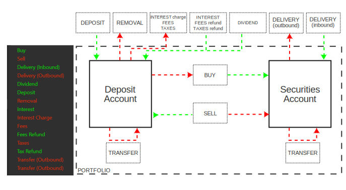

Figure: Transaction menu. {class=align-right style="width:30%"}

In PortfolioPerformance (PP), a transaction represents an operation that alters the state of a portfolio; for example, a deposit will increase a deposit account. As depicted in Figure 1, there are 15 transaction types. `Security transfer ...` and `Transfer between accounts ...` deviate slightly from the others and only appear when there is more than one security and/or deposit account. The transactions can be grouped into pairs of operations that have opposite effects:

- Buy/sell: Buying an asset will increase the value of a security account and decrease a deposit account, whereas selling an asset will have the reverse effect.
- Delivery (inbound/outbound): Inbound delivery will add securities to a security account, while outbound delivery will remove them. The deposit account remains unaffected.
- Deposit/Removal (or withdrawal): Depositing or withdrawing funds will respectively increase or decrease the value of a deposit account.
- Interest/Interest charge: Receiving interest entails an increase in a deposit account, whereas paying interest leads to a decrease.
- Fees/Fees refund:Paying a fee entails a withdrawal from a deposit account, while receiving a refund involves a deposit.
- Taxes/Taxes Refund: Taxes are settled by withdrawing funds from a deposit account; conversely, a tax refund results in a deposit into the account. 

!!! Note
    In theory, PP could suffice with 8 transaction types: trade, delivery, deposit, fees, taxes, interest, transfer, and dividend. Each transaction could be expressed with a positive or negative value, for example: sell or trade(-) and buy or trade (+).
    
    In fact, this is suggested by the fact, that the type of a transaction could be changed in a table such as `All Transactions` by double clicking on the keyword (e.g. Buy) and choosing the alternative from the drop down (sell, delivery inbound, delivery outbound). This technique doesn't work with fees and taxes.    

Figure 2 illustrates the effect of all 15 transaction types on the deposit and securities account. Analyzing Figure 2 will clarify the impact that each transaction type has on a portfolio.

- Security accounts are exclusively impacted by buy, sell, delivery (inbound & outbound), and Security Transfer transactions. This likely explains why they are grouped together with a divider line (see figure 1). It's important to note that while a buy/sell transaction affects both deposit and security accounts, delivery and security transfer transactions do not. A delivery is essentially a buy/sell transaction without the involvement of deposits and is represented as originating from outside the portfolio.

- All transaction types, except delivery and security transfer (see above), will affect the deposit account. These effects could manifest as inflows (green color) or outflows (red color).

- The coloring scheme might be a bit confusing. In the image on the left side of Figure 2, which represents the `All Securities` view, a buy transaction results in an outflow from the deposit account, yet it's depicted in green. Conversely, a transfer (from one security/deposit account to another) is depicted in red.

- With the exception of interest, all transaction types are associated with a specific security, such as a share. Interest, on the other hand, is only linked to a deposit account. One implication of this is that interest on bonds should be recorded as a dividend in PP if you wish to maintain the connection with the bond.

Figure: All 15 transaction types with their effect.{class=pp-figure}

