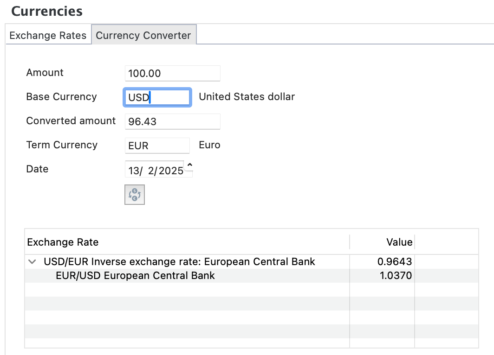

Historical exchange rates and a Currency Converter can be found under the menu `View > General Data > Currencies`. More than 5O currency combinations such as EUR/USD (see Figure 1) are provided. These exchange rates are retrieved from [The European Central Bank](https://www.ecb.europa.eu/stats/policy_and_exchange_rates/euro_reference_exchange_rates/html/index.en.html) (ECB) and go back until the year 1999 when the EUR was introduced on the financial markets. They are in fact reference rates and will probably differ slightly from the real transaction rates that your broker or bank will use. Only a chart can be displayed; no numerical data. The context menu of the chart is described [elsewhere](../../view/securities/all-securities.md#chart-menu).

Figure: Exchange Rates and Currency Converter. {class=pp-figure}

!!! Note

    You can download a CSV file with all exchange rates going back to 1999 at [Euro foreign exchange reference rates](https://www.ecb.europa.eu/stats/policy_and_exchange_rates/euro_reference_exchange_rates/html/index.en.html) webpage; scroll down to time series.

Figure: Currency Converter. {class=align-right style="width:50%"}

The second tab in Figure 1 displays the Currency Converter (see figure 2). With this tool you can convert any amount from the base currency to a counter currency for a specific date. In the foreign exchange (forex) market, currency pairs are commonly depicted as XXX/YYY where the XXX is the base currency. One unit of the base currency XXX is worth YYY units of the counter currency. For example, on February 13, 2025 the exchange rate EUR/USD = 1.0370 means that 1 EUR is worth 1.0370 USD.

Since EUR/USD = 1.0370, it follows that USD/EUR = 0.9643. Which quotation would you prefer? This depends a bit on your domestic currency (the one you use every day) and your preference for multiplication or division.

As a result, there are two types of quotation: direct (or price) quotation versus indirect (or quantity) quotation. By default, Portfolio Performance assumes the latter one, but you can change the quotation type with the menu `Help > Preferences > Presentation` menu.

- An indirect quote expresses the amount of foreign currency required to buy or sell one unit of the domestic currency. The price of the domestic currency is expressed in terms of a foreign currency. For a citizen of the European Community, the quotation EUR/USD = 1.0370 is an indirect quotation.
- In a direct quote, the foreign currency is the base currency, while the domestic currency is the counter currency. For a citizen of the European Community, the quotation USD/EUR = 0.9643 is a direct quotation.

You can display both types by clicking the `Switch currencies` button located beneath the date field in figure 2.