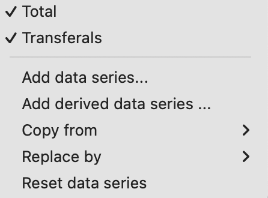
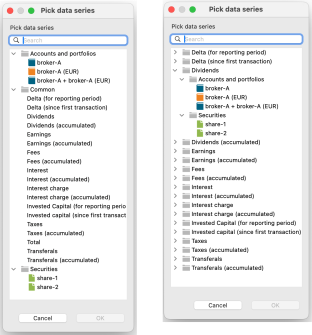

# Statement of Assets &rsaquo; Chart

Using the menu `View > Reports > Statement of Assets > Chart` or the sidebar, you can generate a graphical representation of the *value* of your assets over time. It is similar to the other chart below (`View > Reports > Performance > Chart`), but instead of showing asset values, that chart displays the *performance* over time.

You can select the desired reporting period using the dropdown menu in the top-right corner. By default, the periods of one, two, or three years are available. Additionally, you have the option to create a custom time period using the `New` feature or `Manage`the existing periods; see [Reporting Period](../../../../concepts/reporting-period.md) for a description.

The default `Standard` View has a time period of one year, displays two data series (Total and Transferals; see below) in black and grey, and shows the Y-axis starting from zero near the bottom of the chart. All of these features can be customized. It is generally good practice to first create a new view using the `New View` button (top right). This new view initially duplicates the default Standard View, allowing you to customize it as needed. Using the drop-down menu to the right of the view name, you can duplicate, rename, or delete a view. If the Standard View is deleted, it will be automatically recreated with its default settings.

With the `Export data as CSV` button, you create a comma-separated Values (CSV) file of the data of the visible chart or export the chart as an image. The :gear: Gear icon is discussed below.

## Axes
The x-axis represents time.  Unlike the performance chart (found under [View > Reports > Performance > Chart](../performance/performance-chart.md)), the timeseries are always displayed at a daily interval.

The y-axis displays the total value of your assets, denominated in the portfolio's default currency. Larger numbers are condensed by adding 'k' or 'm', where 1k equals 1000 units of the portfolio currency and 1m is one million. You can use the arrow keys on your keyboard or use the context menu to scroll in the chart (see Figure 1).

- Press the :octicons-triangle-up-24: Arrow Up key on your keyboard to scroll up, shifting the view to higher values (e.g., from 0–500 to 100–600 in Figure 1), or the :octicons-triangle-down-24: Arrow Down key to move to lower values.
- Use the :octicons-triangle-left-24: Arrow Left key to view an earlier time frame and the :octicons-triangle-right-24: Arrow Right key to see a later period.

Hold Ctrl or (:material-apple-keyboard-command: Cmd on macOS) while using the arrow keys to zoom in or out. 

- With Ctrl+Arrow Left (:material-apple-keyboard-command: :octicons-triangle-left-24:), you zoom in on the X-axis (showing smaller time periods: Years > Quarters > Months > ...). Ctrl+Arrow Right (:material-apple-keyboard-command: :octicons-triangle-right-24:) displays larger periods.

- Ctrl+Arrow Up (:material-apple-keyboard-command: :octicons-triangle-up-24:) zooms in on the y-axis. The boundaries (e.g. 0 - 500) are reduced to lesser values (e.g. 100 - 400). Ctrl+Arrow Down (:material-apple-keyboard-command: :octicons-triangle-down-24:) zooms out on the y-axis, expanding the boundaries.

 You can also adjust the scale of the Y-axis by scrolling with the middle mouse button. Hold the mouse cursor at the vertical position in the chart, where you want to increase or decrease the scale around. This can be useful for zooming in on a specific data point in the graph.

 Use the 0 (zero) key to reset the chart to its original scale.

Figure: Chart of the Total value of the demo portfolio.{class=pp-figure}

## Canvas

The canvas is a graphical representation of one or more data series. A data series typically comprises a set of paired data points presented in a table format, such as dates and their corresponding values. By default, two data series are displayed: `Transferals` (primarily deposits) and `Total` (see below for an explanation of all possible data series). When you left-click the canvas and hold the mouse down on a specific day, for example, January 14, 2022, a tooltip window will appear, displaying detailed values for all selected data series on that day.

Right-clicking on the chart canvas displays the context menu, providing additional options (see Figure 1).

- Crosshair: Upon selecting this option, a large crosshair will appear on top of the chart after left-clicking the canvas (see Figure 1). The origin is set at the mouse position of the click. As long as the option is activated, you can reposition the origin. The crosshair facilitates easier reading of the exact value of a specific point within the data series.
- Measure distance: Select this option if you want to determine the exact difference in time and value between two points on the chart. Click and drag a line between two points. The tooltip, e.g. `201 | 37.10 +19.63%` indicates a difference of 201 days with a value increase of 37.10 EUR or +19.63% between the two points.
- Original size: Pressing the O (zero) key will reset the chart to its maximum visibility, reverting any zoom in or out adjustments that have been made.
- Various navigation options with their respective shortcut keys, such as Zoom In, Scroll Up, and more (see above).
- Save diagram: This feature allows you to save the *visible* chart as a PNG or JPG image on your computer.

## Legend

Right-clicking on the legend icons (for example, the blue or orange square from Figure 1) will give you access to additional formatting options (see Figure 1). For all types of data series and their legend entries, you can modify the `Color`, `Position` (Send backwards, Send to back or Bring forward, and Bring to Front), and `Sort` (A-Z or Z-A). The latter two options will reorganize the legend entries from left to right accordingly. In the case of a line-type data series like the Total value, you can also adjust the `Line Style` (solid, dash, dot, ...), and the `Show Area` option (which fills the area below the data series). In addition, you have the option to either hide (where the legend entry remains visible but is crossed out, and the data series is not displayed on the chart) or remove it entirely (both the legend and the data series are completely removed from the chart). You can also hide or reveal a data series by double-clicking on the corresponding legend icon.

## Configure chart

Figure: Configure menu.{class=align-right}

Using the :gear: gear icon located at the top right (see Figure 1), you can see the data series that are displayed in the graph, such as Total and Transferals. Once a data series is added to the chart, it will appear in the menu (see Figure 2) but will disappear in the list of available data series (see Figure 3).

Portfolio Performance offers two additional charts: the Performance chart (under `View > Reports > Performance > Chart`) and the Historical Returns and Volatility chart (under `View > Reports > Performance > Return/Volatility`). The `Copy from` option adds the data series from these chart views to your current chart. The `Replace by` option works similarly but removes the existing data series before adding the new ones.

The actual data of the chart is configured with the :gear: menu options `Add data series ...` and `Add derived data series ...`. A data series is a set of paired data points such as a date and the total portfolio value. A Derived data series is calculated or derived from the original data series such as `Invested capital`, `Taxes and Fees`, `Dividends`, etc. These derived data series are listed in the right panel of Figure 3 and under the heading `Common` (left panel).

With the `Accounts and Portfolios` option, you can choose to display specific combinations of accounts, such as the *security account* `broker-A` or the *deposit account* `broker-A (EUR)` or the combination. At the bottom of Figure 2, a list of individual securities is provided. Select the appropriate option and hold Ctrl (Cmd) to add more selections. Once you've added a data series, it will no longer appear in the list of available data series in Figure 3, but you'll find it checked in the gear menu. You can remove a data series from the chart by unchecking it in the gear menu or by deleting it from the legend (as explained above).

Figure: Data series (left) and Derived data series (right).{class=pp-figure}

With the `Accounts and Portfolios` option, you can choose to display specific combinations of accounts, such as the security account `broker-A` or the deposit account `broker-A (EUR)` or the combination. At the bottom of Figure 2, you can also select individual securities. Hold Ctrl (Cmd) to add more selections. Once you've added a data series, it will no longer appear in the list of available data series in Figure 3, but you'll find it checked in the gear menu. You can remove a data series from the chart by unchecking it in the gear menu or by deleting it from the legend (as explained above).

Please note that the derived data series are available in both the left and right panels of Figure 3. However, the data in the left panel always represent the entire portfolio, while the right panel allows for a breakdown into sub components. For example, the fees shown in the left panel reflect all fees paid within the portfolio, whereas in the right panel, they can be split by the originating account or security.

- Delta (for the reporting period or since the first transaction) represents the change in an asset's value from the start to the end of the reporting period or from the first transaction to the end of the period. This Delta will fluctuate around zero, for example for the first transaction day the delta will be zero. The chapter on [Reporting Period](../../../../concepts/reporting-period.md) explains that the valuation of a portfolio can differ according to the selected `Reporting Period`.

- Dividends, Earnings (= dividends + interests), Fees, Interest, Interest Charge, and Taxes are available in both accumulated and 'instance' versions. For example, an 'instanced' dividend will be represented as a spike, whereas the accumulated version will display a graph that steadily increases as dividends accumulate over time. These fields are described in [Transactions](../../../transaction/index.md) and are recorded as part of each transaction.

- Invested Capital (for reporting period or since first transaction): the term "invested capital" refers to the total amount of money that an investor has used to purchase various securities, such as stocks, bonds, or other financial instruments. It includes the initial purchase price of the securities, additional investments made over time, and other factors such as fees, taxes, ...

- Total: the total value of the portfolio valuated over time.

- Transferals (instanced and accumulated): Each transferal, whether a deposit/removal or delivery inbound/outbound, is represented by a small spike (positive or negative) on the day the transferal was made (instance). The accumulated version is represented by a block diagram, showing the cumulative net value of all transferals over time.

